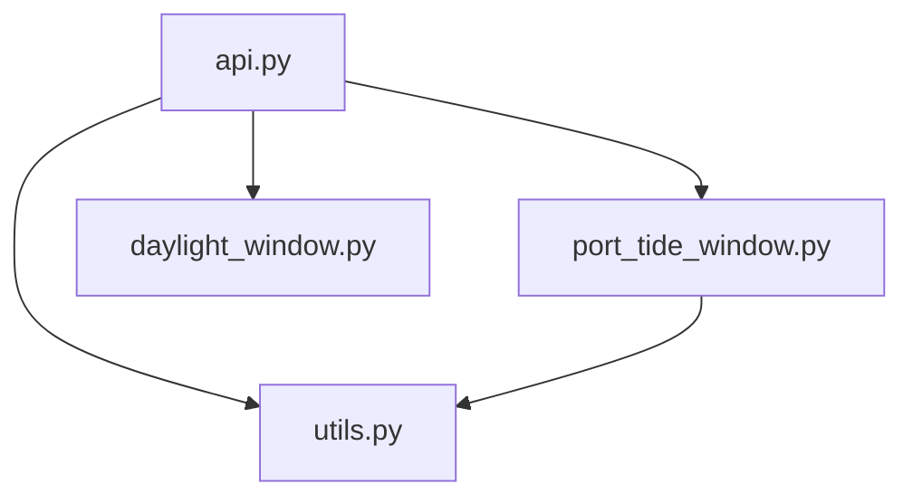

### Code structure
All of the source code is in the current directory, including a jupyter notebook to visualize the result "demo.ipynb".
| File | Description | 
| :---         |     :---      | 
| api.py  | main module to start the API. It contains wrapped APIs for both Part 1 and Part 2. | 
| port_tide_window.py  | The acutal logic code for Part 1  | 
| daylight_window.py  | The acutal logic code for Part 2 | 
| utils.py  | utility module. A helping module to compute union and intersection of intervals |
| demo.ipynb | A jupyter notebook to visualize the result | 
| requirements.txt | pip requirements file | 
### Code dependency


### How to Start API
On windows CMD or powershell: 'python api.py'
On Linux 'python api.py'. you may need to fix the path delimeter in api.py to point to the write location of three csv files.

The API is based on Flask

### How to Use API
I used POSTMAN to test my API. The request type is <b>GET</b>.

URLs:
```
http://127.0.0.1:5000/tide_window?port=AUABP&imo=9790933&arrival=2024-08-01:00:00:00
http://127.0.0.1:5000/tide_daylight_window?port=AUABP&imo=9790933&arrival=2024-08-01:00:00:00
```

The <b>header</b> need to be set as following:
```
Content-Type: application/json
```